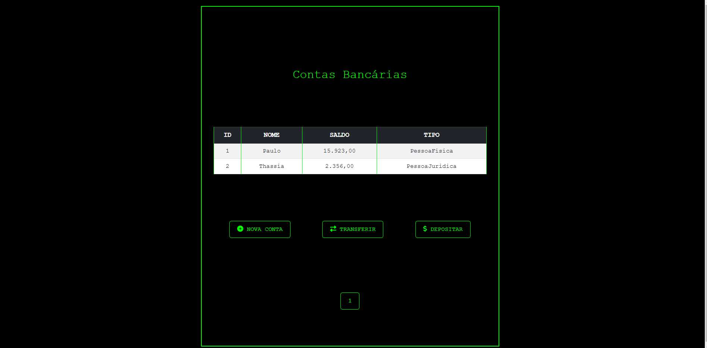

# Transferência Bancária MVC

  
Um sistema web de gerenciamento de contas bancárias desenvolvido em **ASP.NET Core MVC**.




## 📖 Sobre o Projeto
O **Transferência Bancária MVC** é um projeto que simula operações básicas de um banco, como criar contas, realizar transferências, depósitos e saques. Ele foi criado para fins de estudo e explora conceitos como:

- Utilização do padrão MVC.
- Simulação de banco de dados em memória.
- Estilização com CSS personalizado.
- Paginação com responsividade.

## ⚙️ Funcionalidades

- **Criar Conta:** Adicione novas contas bancárias com nome, saldo inicial e tipo de conta.
- **Listar Contas:** Visualize todas as contas em uma tabela com paginação.
- **Transferir:** Realize transferências entre contas existentes.
- **Depositar:** Adicione saldo a uma conta específica.
- **Sacar:** Realize saques, respeitando o limite do saldo.

## 🚀 Tecnologias Utilizadas

- **ASP.NET Core MVC**: Para a estrutura e lógica do aplicativo.
- **Bootstrap**: Para o layout responsivo.
- **CSS Customizado**: Para uma interface única, no estilo terminal.
- **X.PagedList**: Para gerenciar a paginação.
- **Font Awesome**: Para ícones decorativos.

## 📦 Como Executar o Projeto

### Pré-requisitos

- [.NET SDK 8.0](https://dotnet.microsoft.com/) ou superior.
- Um editor de código, como [Visual Studio Code](https://code.visualstudio.com/).

### Passo a Passo

1. Clone este repositório:
   ```bash
   git clone https://github.com/seu-usuario/TransferenciaBancariaMVC.git
   cd TransferenciaBancariaMVC
   ```

2. Restaure os pacotes NuGet:
   ```bash
   dotnet restore
   ```

3. Execute o projeto:
   ```bash
   dotnet run
   ```

4. Acesse o aplicativo no navegador:
   ```
   http://localhost:5287
   ```

## 🛠 Estrutura do Projeto

```
TransferenciaBancariaMVC/
├── Controllers/
│   └── ContaController.cs        # Controlador principal
├── Models/
│   ├── Conta.cs                  # Modelo de conta bancária
│   ├── TipoConta.cs              # Enum para tipos de conta
│   ├── ContaRepository.cs        # Simulação de banco de dados
│   └── ViewModels/               # Modelos para transferências e depósitos
├── Views/
│   ├── Conta/
│   │   ├── Index.cshtml          # Lista de contas com paginação
│   │   ├── Create.cshtml         # Formulário para criar nova conta
│   │   ├── Transferir.cshtml     # Formulário para transferências
│   │   ├── Depositar.cshtml      # Formulário para depósitos
│   │   └── Sacar.cshtml          # Formulário para saques
│   ├── Shared/                   # Layouts e partes compartilhadas
│   └── _Layout.cshtml            # Layout principal
├── wwwroot/
│   ├── css/
│   │   └── terminal-style.css    # Estilização personalizada
│   └── lib/                      # Bibliotecas externas (Bootstrap, Font Awesome)
└── Program.cs                    # Configuração e execução do projeto
```

## 🌟 Próximos Passos

- Adicionar autenticação de usuários.
- Implementar persistência de dados com banco de dados relacional (SQL Server).
- Criar relatórios de movimentações.

## 🤝 Contribuição

Contribuições são bem-vindas! Sinta-se à vontade para abrir issues ou enviar pull requests.
